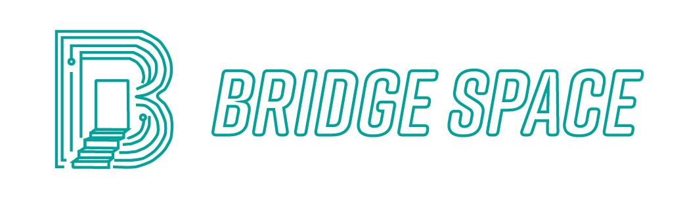

> Connecting Remote Offices via Gamified Touchless Phygital Interfaces

Bridge Space creates a link between remote offices through gamified touchless phygital interfaces. This device utilizes sensors as interactive components and a display screen, and the system is tailored for office environments. The design emphasizes simplicity, ease of use, and gamified features to enhance user engagement.

Starting with human-device interactions, it facilitates seamless communication between devices and extends to connect office workers in different locations. Through these interfaces, activities, and messages are shared between offices, bridging the physical gap between remote offices and fostering a sense of connection among office workers.

## 🪬 Sense
Sensing gesture, environmental data, and electromagnetic induction to create a contactless interaction. \
\
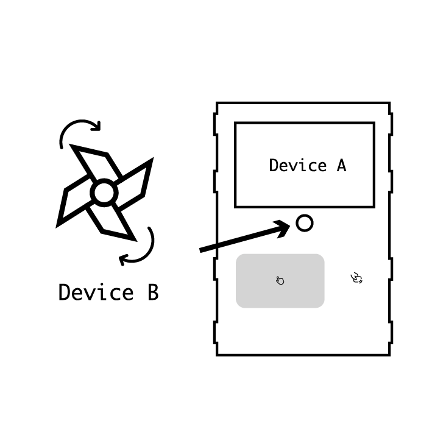
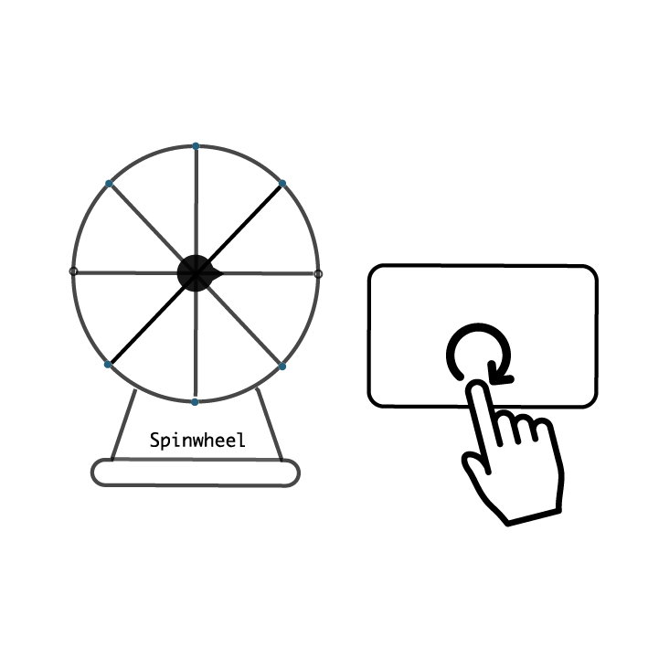
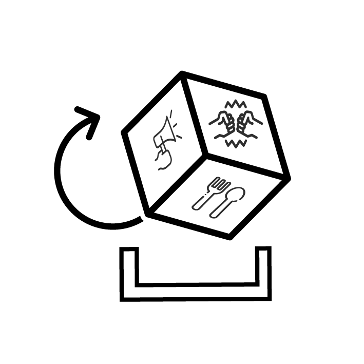

[📹Video Demonstration](https://youtu.be/o8lDl8A0X2c?si=-oIlWewPWmCC0gkX)

## 💼 Deploy
Deployed in two remote offices. \
\
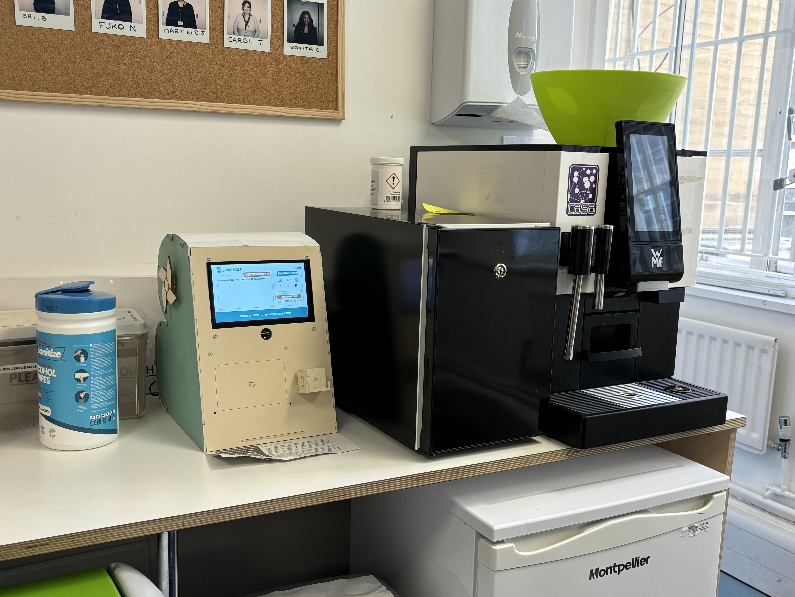
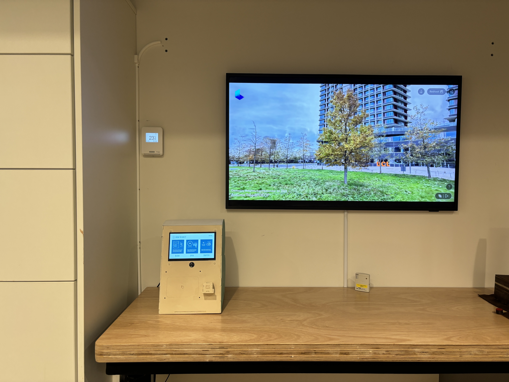 

## 🗣 Communicate
Connecting users in both spaces through a gamified system that provides features such as announcements, games, food and drink selectors, and meeting room availability. 
- **Announcement**: Displays events and other social and academic activities.
- **Game**: Starts a running competition spin wheel via gesture detection.
- **Food Selector**: Provides a random food choice via the spin wheel.
- **Drink Selector**: Offers a random drink selection via the spin wheel.
- **Meeting Room Status**: Displays the availability and location of meeting rooms.
- **Device Instructions**: Provides instructions on how to interact with the device.
  
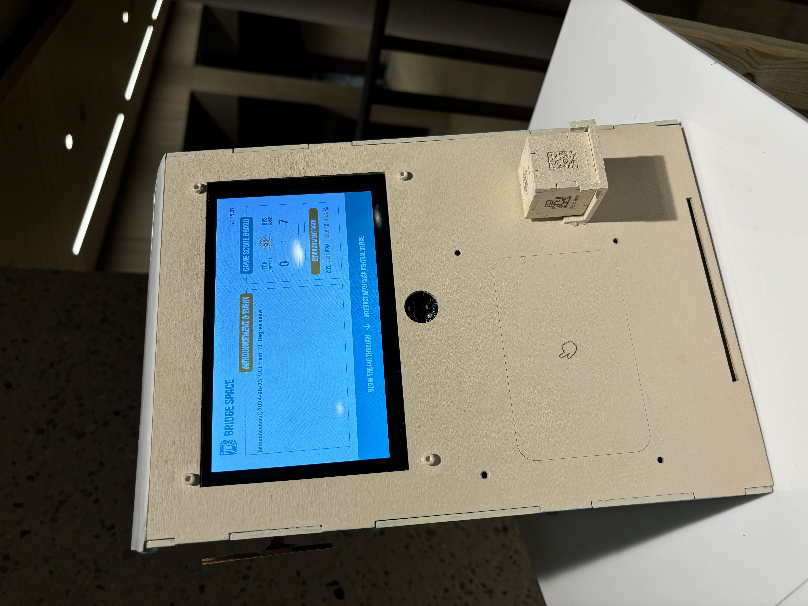 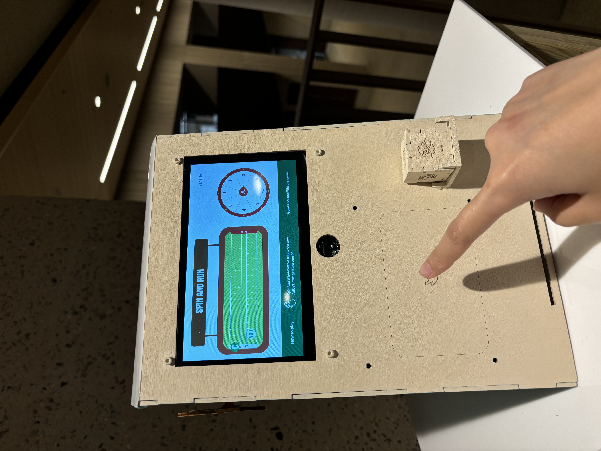  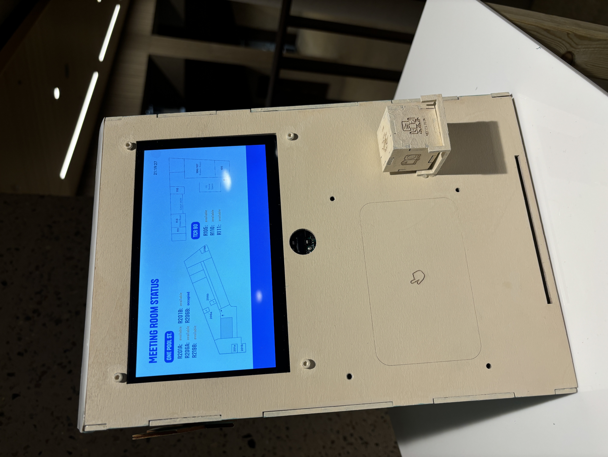 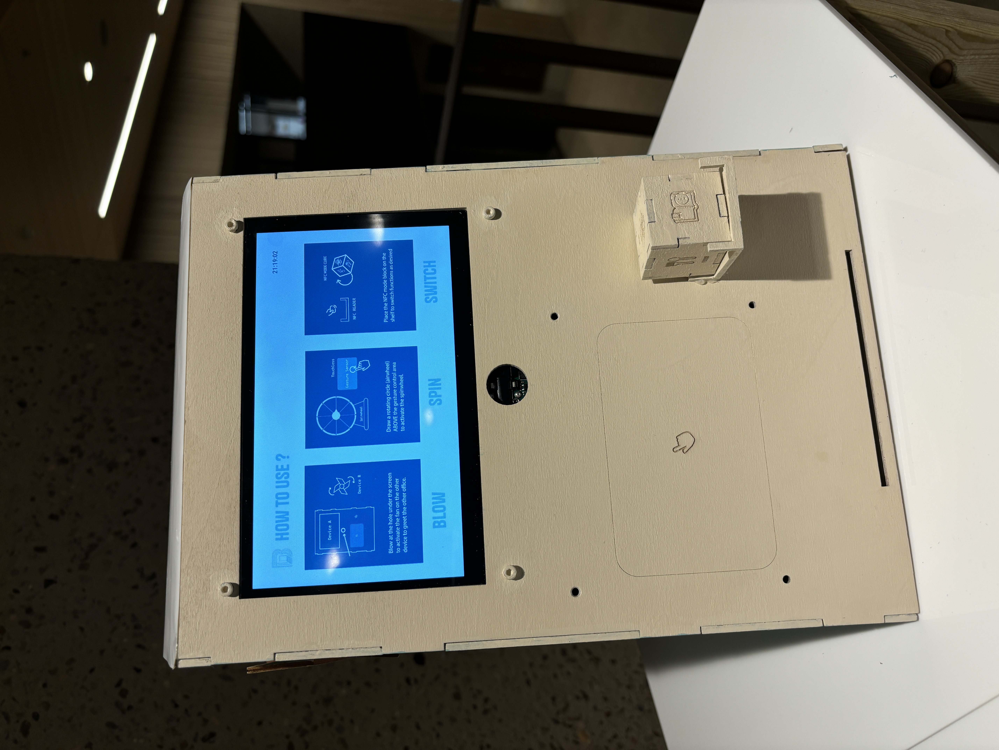

## 🖼 Exhibition

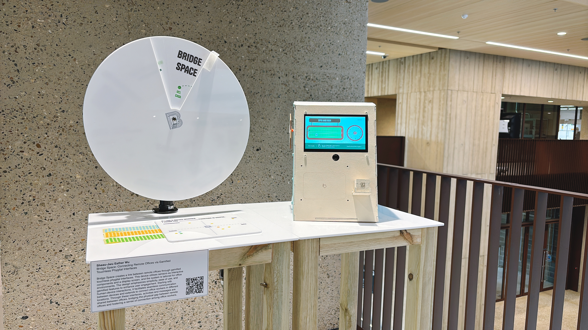 

